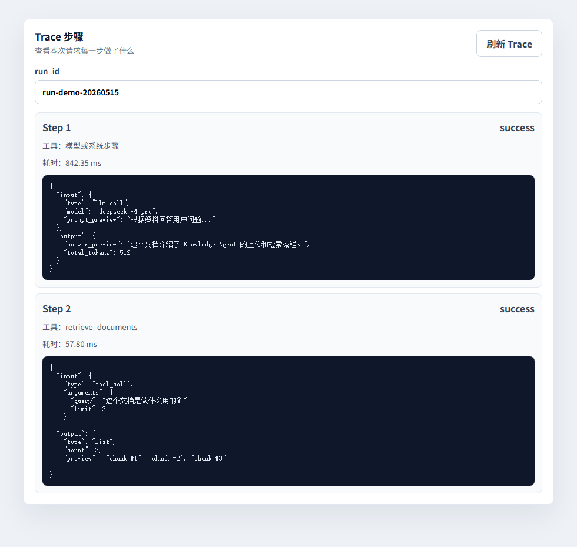
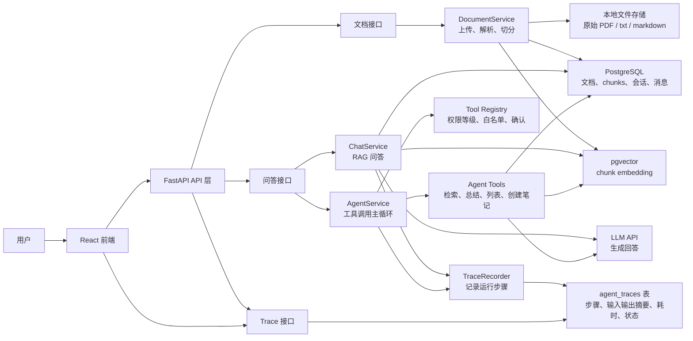
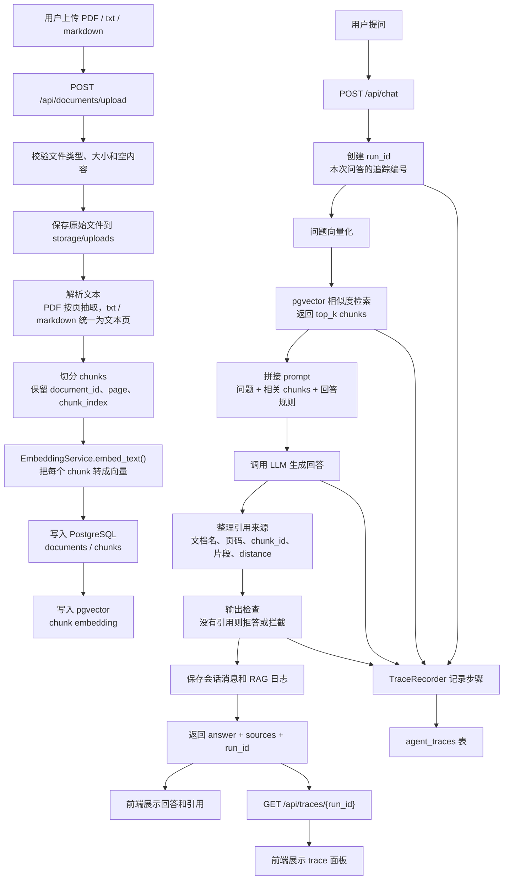

# Knowledge Agent

一个面向企业知识库场景的 RAG + Agent 项目。用户可以上传 PDF、txt、markdown 文档，系统会自动解析、切分、向量化并保存到 PostgreSQL + pgvector；提问时，系统会检索相关片段、调用大模型生成回答，并返回引用来源和 trace 追踪信息。

## 这个项目解决什么问题

很多企业文档散落在 PDF、说明书、内部知识库和项目资料里，普通搜索只能按关键词匹配，无法稳定回答“这份资料到底说了什么”“答案来自哪里”“Agent 为什么这样回答”。

Knowledge Agent 解决的是：

- 让用户用自然语言查询已上传文档。
- 让回答必须带引用来源，方便追溯。
- 让 Agent 工具调用有权限边界，避免乱执行写入或危险操作。
- 让每次问答都有 trace，方便排查检索、模型、工具和输出检查问题。
- 用评测集统计检索命中率、引用完整率和失败原因，而不是凭感觉判断效果。

## 核心亮点

- 文档处理：支持 PDF、txt、markdown 上传、解析、切分和入库。
- 向量检索：使用 PostgreSQL + pgvector 保存 embedding，并按相似度检索 chunks。
- RAG 问答：问题 -> 向量化 -> 检索 -> 拼接上下文 -> LLM 回答。
- 引用溯源：回答返回文档名、页码、chunk_id、引用片段和距离分数。
- 拒答机制：检索分数不足或缺少引用时，不让模型胡编。
- Agent 工具：支持文档检索、文档总结、文档列表和创建笔记。
- 权限控制：工具分为只读、写入、危险三级；写入工具需要确认，危险工具不开放。
- Trace 追踪：记录模型调用、工具调用、输入输出摘要、耗时和状态。
- 评测闭环：使用固定题库统计 top-3 检索命中率、引用完整率和失败分类。

## 技术栈

- 后端：Python、FastAPI、Pydantic、SQLAlchemy
- 数据库：PostgreSQL、pgvector
- 文档解析：pypdf
- LLM 接入：OpenAI Python SDK 兼容接口
- 前端：React
- 工程能力：RAG、Tool Calling、Guardrails、Trace、离线评测

## 当前已实现能力

- 文档上传：支持 PDF、txt、markdown，限制文件类型和 10MB 大小。
- 文档解析：PDF 按页抽取文本，txt/markdown 统一为一页文本结构。
- 文本切分：按 chunk size 和 overlap 切分，并保存页码和 chunk 顺序。
- Embedding：使用 `text-embedding-v4` 生成向量。
- 向量检索：使用 PostgreSQL + pgvector 做相似度搜索。
- RAG 问答：用户问题 -> embedding -> 检索 chunks -> 拼接上下文 -> LLM 回答。
- 引用来源：回答返回 `document_filename`、`page_number`、`chunk_id`、引用片段和 `distance`。
- 拒答逻辑：检索距离超过阈值时返回“我在已上传文档里没有找到足够信息。”。
- 聊天历史：支持会话列表、消息历史、继续已有会话和删除会话。
- 流式输出：`POST /api/chat/stream` 支持逐步返回模型回答。
- RAG 调用日志：保存每次问题、回答、耗时和检索到的 chunks，并支持按会话查询。
- 前端工作台：支持上传文档、查看文档列表、提问、展示回答和引用来源。
- Agent 工具：支持文档检索、文档总结、文档列表和创建笔记。
- Guardrails：支持输入注入检查、工具权限检查和输出引用检查。
- Trace 追踪：`/api/chat` 返回 `run_id`，可按 `run_id` 查询模型和工具调用步骤。
- 观测统计：`GET /api/traces/stats` 统计平均响应时间、失败率和平均工具调用次数。
- 评测脚本：支持统计检索命中、引用完整率和失败原因。

## 前端截图




## 项目架构图



这张图从左到右读：

- 用户只接触 React 前端，上传文档、提问和查看 trace 都从前端进入。
- FastAPI 负责把请求分发给文档接口、问答接口和 trace 接口。
- 文档链路负责把原始文件解析成 chunks，并保存元数据、原文片段和 embedding。
- 问答链路先用 pgvector 检索相关 chunks，再调用 LLM 生成带引用的回答。
- Agent 链路通过工具注册表控制权限，只允许当前会话开放的工具执行。
- TraceRecorder 会把模型调用、工具调用、失败原因和耗时写入 `agent_traces`，前端再按 `run_id` 查询展示。

## 核心流程图



这张流程图可以按两条线理解：

- 文档线：上传文件后，系统先保存原文件，再解析文本、切分 chunks、生成 embedding，最后把元数据和向量分别保存到 PostgreSQL 和 pgvector。
- 问答线：用户提问后，系统先把问题转成向量，检索相关 chunks，再把检索结果拼进 prompt 调用 LLM，最后返回回答、引用来源和 `run_id`。
- 追踪线：同一次问答共享一个 `run_id`，检索、模型调用、输出检查等关键步骤会写入 `agent_traces`，前端可以用这个 `run_id` 查看完整执行过程。

## 项目难点和解决方案

| 难点 | 问题 | 解决方案 |
| --- | --- | --- |
| 引用溯源 | RAG 如果只返回自然语言答案，用户不知道答案来自哪份文档、哪一页，也无法判断回答是否可信。 | 检索结果保留 `document_filename`、`page_number`、`chunk_id`、`content` 和 `distance`，最终回答通过 `sources` 返回引用来源，前端展示文档名、页码和原文片段。 |
| 拒答机制 | 检索不到相关资料时，如果仍然把问题交给模型自由回答，模型可能编出看似合理但没有来源的内容。 | 设置检索距离阈值；当相似度不足或没有可用 chunks 时，直接返回“我在已上传文档里没有找到足够信息。”；输出检查发现确定性回答没有引用时，也会拒答或拦截。 |
| 工具权限 | Agent 一旦能调用工具，就需要区分哪些工具只读、哪些会写入数据、哪些危险，否则模型可能越权执行不该执行的操作。 | 用 Tool Registry 给工具分为只读、写入、危险三级；只读工具可直接执行，`create_note` 这类写入工具需要用户确认，删除类危险工具当前不开放；不同会话还有工具白名单。 |
| Trace 排查 | 只看最终回答很难判断问题发生在哪里：可能是检索没命中、模型输出异常、工具参数错，也可能是输出检查拦截。 | 每次问答创建一个 `run_id`，通过 `TraceRecorder` 记录模型调用、工具调用、输入输出摘要、耗时和状态，写入 `agent_traces`，前端可以按 `run_id` 展示完整步骤。 |
| 评测闭环 | 只凭肉眼试几个问题，很难证明 RAG 质量真的变好了，也无法判断参数调整是否有效。 | 建立固定评测集 `eval/questions.json`，批量调用 RAG 接口，统计 top-3 检索命中率、引用完整率和失败原因；优化 chunk size、top_k、score threshold 时，用同一套评测结果做前后对比。 |

面试时可以这样总结这些难点：

```txt
这个项目不只是把文档丢给大模型回答，而是围绕可信度和可排查性做了工程设计。
我重点处理了五个问题：回答必须能引用溯源，资料不足时要拒答，Agent 工具调用要有权限边界，每次运行要能通过 trace 排查，RAG 效果要能通过评测集量化。
所以这个项目既能演示功能，也能解释回答质量、安全边界和问题定位流程。
```

## 简历项目描述

第一版简历项目描述见：[docs/resume-project-description.md](docs/resume-project-description.md)。

这版简历描述避免使用空泛的掌握程度表达，改用“实现、设计、构建、优化、统计”来说明实际交付。

## 项目面试问题

20 个项目面试问题和回答见：[docs/interview-questions.md](docs/interview-questions.md)。

这些问题重点覆盖项目架构、RAG、Agent 工具权限、trace 排查和评测优化。

## Demo 演示脚本

3-5 分钟录屏脚本见：[docs/demo-script.md](docs/demo-script.md)。

脚本覆盖上传文档、chunk 检索、RAG 问答、引用来源、trace 查询和 Agent 工具权限演示。

## MCP 加分项

MCP 基本概念和本项目只读工具边界见：[docs/day68-mcp-basics.md](docs/day68-mcp-basics.md)。

本项目的 MCP 方向只计划暴露 `list_documents` 和 `search_documents` 这类只读能力，不开放删除、写入或本地命令执行。

第 10 周部署和 MCP 设计总结见：[docs/week10-deployment-and-mcp.md](docs/week10-deployment-and-mcp.md)。

## 启动项目

### 0. 前置条件（新电脑需要装一次）

- [Docker Desktop](https://www.docker.com/products/docker-desktop/) — 跑数据库和后端
- [Node.js](https://nodejs.org/) — 跑前端（带 npm）
- [Git](https://git-scm.com/) — 克隆代码

安装后重启终端，验证：

```powershell
docker --version
node --version
git --version
```

### 1. 克隆代码 + 配置环境变量

```powershell
git clone https://github.com/AshenWait/knowledge-agent.git
cd knowledge-agent
Copy-Item .env.example .env
```

编辑 `.env`，填入自己的 API key：

```env
DEEPSEEK_API_KEY=你的 DeepSeek API key
DASHSCOPE_API_KEY=你的百炼 API key
```

### 2. 启动后端 + 数据库（Docker Compose）

**首次启动或代码有改动时**（重新构建镜像再启动）：

```powershell
docker compose up --build
```

**日常启动**（已有镜像，直接后台启动）：

```powershell
docker compose up -d
```

这一步会拉起 PostgreSQL + pgvector（端口 5433）和 FastAPI 后端（端口 8000）。
首次构建镜像需要几分钟，之后启动很快。

### 3. 启动前端

```powershell
cd frontend
npm install           # 仅首次
npm run dev
```

默认开在 `http://localhost:5173`。

### 访问地址

| 地址 | 内容 |
|------|------|
| http://localhost:5173 | 前端工作台 |
| http://localhost:8000 | API |
| http://localhost:8000/docs | 接口文档 |
| http://localhost:8000/health | 健康检查 |

### 常用命令

```powershell
docker compose ps         # 查看容器状态
docker compose down       # 停止服务（⚠ 不加 -v，否则删数据库）
```

## 文档上传和解析验证

项目自带 3 个测试文档：

| 文件 | 用途 |
| --- | --- |
| `tests/fixtures/sample.pdf` | 验证 PDF 上传和 `pypdf` 文本抽取 |
| `tests/fixtures/sample.txt` | 验证 txt 上传和文本解析 |
| `tests/fixtures/sample.md` | 验证 markdown 上传和文本解析 |

启动服务后，打开接口文档：

```txt
http://127.0.0.1:8000/docs
```

在 `POST /api/documents/upload` 中选择测试文档上传。成功时会返回：

```json
{
  "document_id": 1,
  "filename": "sample.pdf",
  "content_type": "application/pdf",
  "file_path": "storage\\uploads\\sample.pdf",
  "page_count": 1
}
```

然后可以用文档管理接口验证数据库记录：

| 接口 | 作用 |
| --- | --- |
| `GET /api/documents` | 查看所有已上传文档 |
| `GET /api/documents/{document_id}` | 查看单个文档元数据 |
| `DELETE /api/documents/{document_id}` | 删除单个文档数据库记录 |

当前上传限制：

- 只支持 `.pdf`、`.txt`、`.md`、`.markdown`。
- 文件不能超过 10MB。
- 空文件会被拒绝。
- 没有可解析文本的文件会被拒绝。

## 当前程序流程

### `/api/chat` 聊天接口

一次聊天请求的流程：

```txt
POST /api/chat
  -> app/api/chat.py 的 chat()
  -> app/schemas/chat.py 的 ChatRequest 校验请求体
  -> app/core/database.py 的 get_db() 提供数据库 Session
  -> app/services/chat.py 的 ChatService 处理聊天业务
  -> app/services/llm.py 的 LLMService 调用大模型
  -> app/models/chat.py 的 ChatSession / ChatMessage 保存会话和消息
  -> app/schemas/chat.py 的 ChatResponse 返回结果
```

关键文件说明：

| 文件 | 作用 |
| --- | --- |
| `app/main.py` | 创建 FastAPI 应用，并挂载路由 |
| `app/api/chat.py` | 定义 `/api/chat` 接口，负责接收请求和调用业务层 |
| `app/schemas/chat.py` | 定义请求和响应格式：`ChatRequest`、`ChatResponse` |
| `app/services/chat.py` | 聊天业务逻辑：创建会话、保存消息、调用 LLM |
| `app/services/llm.py` | 调用 DeepSeek 兼容接口，并计算模型耗时 |
| `app/core/database.py` | 创建数据库连接，并提供 `get_db()` |
| `app/models/chat.py` | 定义聊天相关数据库表：`ChatSession`、`ChatMessage` |

### `/api/documents/upload` 文档上传接口

一次 PDF 上传请求的流程：

```txt
POST /api/documents/upload
  -> app/api/documents.py 的 upload_document()
  -> UploadFile 接收浏览器上传的文件
  -> 检查文件后缀，只允许 .pdf、.txt、.md、.markdown
  -> 读取文件内容，拒绝空文件，并限制最大 10MB
  -> 保存到 storage/uploads/
  -> app/services/document_parser.py 的 parse_document() 统一解析文档
  -> 解析失败或没有可解析文本时返回清楚错误
  -> app/services/text_splitter.py 的 split_pages() 切分 chunks
  -> app/services/document.py 的 DocumentService 保存文档元数据
  -> 保存 chunks 到 PostgreSQL
  -> 返回 document_id、filename、content_type、file_path、page_count、chunk_count
```

关键点：

| 名称 | 作用 |
| --- | --- |
| `UploadFile` | FastAPI 用来接收上传文件 |
| `python-multipart` | 解析 `multipart/form-data` 文件上传请求 |
| `Path("storage/uploads")` | 表示文件保存目录 |
| `file.file.read()` | 读取上传文件内容 |
| `write_bytes()` | 把二进制内容写入本地文件 |
| `parse_document()` | 根据文件后缀选择 PDF 或文本解析方式 |
| `split_pages()` | 把解析后的页文本切成 chunks |
| `PdfReader` | pypdf 用来读取 PDF 结构 |
| `page.extract_text()` | 抽取某一页的文本 |
| `HTTPException` | 主动返回清楚的接口错误 |
| `page_count` | 当前 PDF 的页数 |
| `chunk_count` | 当前文档保存的 chunk 数量 |
| `DocumentService` | 保存文档元数据到 PostgreSQL |
| `document_id` | 数据库生成的文档记录 ID |

### 文档管理接口

当前支持 3 个文档管理接口：

| 接口 | 作用 |
| --- | --- |
| `GET /api/documents` | 返回所有文档元数据 |
| `GET /api/documents/{document_id}` | 根据 ID 返回单个文档 |
| `GET /api/documents/{document_id}/chunks` | 查询某篇文档的 chunks |
| `DELETE /api/documents/{document_id}` | 根据 ID 删除文档数据库记录 |

接口分层：

```txt
app/api/documents.py
  -> 接收 HTTP 请求，处理 404 等接口错误
app/services/document.py
  -> list_documents() 查询文档列表
  -> get_document() 查询单个文档
  -> list_chunks() 查询某篇文档的 chunks
  -> delete_document() 删除文档记录和对应 chunks
app/schemas/document.py
  -> DocumentResponse 定义文档响应格式
  -> ChunkResponse 定义 chunk 响应格式
```

### 文本切分流程

解析后的文档页会继续切成 chunks，供后续 embedding 和检索使用。

```txt
app/services/document_parser.py
  -> parse_document() 返回 page_number + text
app/services/text_splitter.py
  -> split_text() 按 chunk_size 和 overlap 切分一段文本
  -> split_pages() 把多页文本切成带 page_number、chunk_index、content 的 chunks
```

关键概念：

| 名称 | 作用 |
| --- | --- |
| `chunk_size` | 每个 chunk 的最大字符数 |
| `overlap` | 相邻 chunk 重叠的字符数，用来保留上下文 |
| `chunk_index` | chunk 在整篇文档中的顺序 |

### Embedding 和向量检索流程

上传文档后，系统会给每个 chunk 生成 embedding，并保存到 PostgreSQL 的 pgvector 字段中。

```txt
app/services/embedding.py
  -> EmbeddingService.embed_text() 调用百炼 embedding API
app/services/document.py
  -> create_chunks() 保存 chunk 原文、页码、向量和模型名称
  -> search_similar_chunks() 使用 cosine distance 查询相似 chunks
app/api/documents.py
  -> GET /api/documents/search 提供文档语义搜索接口
```

搜索接口：

| 接口 | 作用 |
| --- | --- |
| `GET /api/documents/search?query=...&limit=3` | 在全部文档中搜索相似 chunks |
| `GET /api/documents/search?query=...&document_id=1` | 限定在某篇文档内搜索 |

### RAG 问答流程

`POST /api/chat` 会把用户问题转换为向量，检索相关文档片段，再把片段作为上下文交给大模型回答。

```txt
POST /api/chat
  -> 校验消息内容和长度
  -> 如果传入 document_id，先确认文档存在
  -> 如果没有 session_id，创建新会话
  -> 用户问题生成 embedding
  -> pgvector 检索相似 chunks
  -> 使用 max_rag_distance 过滤低相关结果
  -> 拼接资料和聊天历史
  -> 调用 LLM 生成回答
  -> 保存用户消息和助手消息
  -> 保存 RAG 调用日志
  -> 返回回答、耗时和引用来源
```

请求示例：

```json
{
  "message": "这个文档是做什么用的？",
  "document_id": 1
}
```

响应中的 `sources` 会返回引用来源：

```json
[
  {
    "chunk_id": 1,
    "document_id": 1,
    "document_filename": "sample.txt",
    "page_number": 1,
    "chunk_index": 0,
    "content": "Knowledge Agent txt test document...",
    "distance": 0.5687793534266556
  }
]
```

### 流式聊天接口

`POST /api/chat/stream` 用于边生成边返回文本，适合前端做类似 ChatGPT 的逐字输出效果。

```powershell
curl.exe -N -X POST "http://127.0.0.1:8000/api/chat/stream" `
  -H "Content-Type: application/json" `
  --data-raw '{"message":"这个文档是做什么用的？","document_id":1}'
```

普通聊天接口返回完整 JSON；流式接口当前返回 `text/plain` 文本流，并在流结束后保存完整助手回答。

### 聊天历史和 RAG 日志接口

| 接口 | 作用 |
| --- | --- |
| `GET /api/chat/sessions` | 查看所有聊天会话 |
| `GET /api/chat/sessions/{session_id}/messages` | 查看某个会话下的聊天消息 |
| `DELETE /api/chat/sessions/{session_id}` | 删除某个聊天会话 |
| `GET /api/chat/sessions/{session_id}/rag-logs` | 查看某个会话下的 RAG 调用日志 |

RAG 调用日志会保存：

- 用户问题 `question`
- 最终回答 `answer`
- 模型耗时 `latency_ms`
- 当时检索到的 chunks `retrieved_chunks`
- 每个 chunk 的文档名、页码、片段内容和相似度距离

## Agent 工具系统

第 6 周开始，项目从固定 RAG 问答升级为 Agent 工具调用模式。第 7 周进一步给 Agent 增加 Guardrails，让工具调用、用户输入和模型输出都有边界。

当前 Agent 已支持这些工具：

| 工具名                                    | 权限等级 | 作用                        | 当前状态             |
| ----------------------------------------- | -------- | --------------------------- | -------------------- |
| `list_documents()`                        | 只读工具 | 查询已上传文档列表          | 已实现，可直接执行   |
| `retrieve_documents(query)`               | 只读工具 | 根据用户问题检索相关 chunks | 已实现，可直接执行   |
| `summarize_document(document_id)`         | 只读工具 | 总结指定文档并返回引用来源  | 已实现，可直接执行   |
| `create_note(title, content, source_ids)` | 写入工具 | 创建笔记并保留来源 chunk    | 已实现，需要用户确认 |
| `delete_document(document_id)`            | 危险工具 | 删除文档数据                | Agent 当前不开放     |

### 工具权限等级

| 权限等级 | 含义                                 | 当前策略           |
| -------- | ------------------------------------ | ------------------ |
| 只读工具 | 只查询数据，不修改数据库             | 可以直接执行       |
| 写入工具 | 会新增或修改数据                     | 执行前必须用户确认 |
| 危险工具 | 删除数据、执行系统命令、访问敏感资源 | 当前不开放         |

当前项目暂不开放删除类 Agent 工具，也不允许 Agent 执行本地系统命令。

### 会话工具白名单

不同会话只开放必要工具，避免 Agent 在不需要的场景里看到过多能力。

| 会话类型  | 开放工具                                                     |
| --------- | ------------------------------------------------------------ |
| `default` | `list_documents`、`retrieve_documents`、`summarize_document` |
| `note`    | `list_documents`、`retrieve_documents`、`summarize_document`、`create_note` |

工具执行前会先检查：

```txt
工具是否在当前会话白名单中
  -> 是否允许直接执行或需要确认
  -> 参数是否合法
  -> 真正执行工具
```

## Observability 和 Trace

第 8 周开始，项目增加了 Agent 运行追踪能力。它解决的问题是：当一次问答变慢、没有检索到资料、工具调用失败或模型返回异常时，不能只看最终回答，而要看到这次请求中每一步发生了什么。

一次普通问答现在会多返回一个 `run_id`：

```txt
POST /api/chat
  -> ChatService 创建 TraceRecorder
  -> LLMService / AgentService 写入 trace step
  -> ChatResponse 返回 answer、sources、run_id
  -> 前端用 run_id 请求 GET /api/traces/{run_id}
  -> Trace 面板展示每一步 input、output、latency_ms、status
```

Trace 核心表是 `agent_traces`，主要字段如下：

| 字段 | 作用 |
| --- | --- |
| `run_id` | 一次完整请求的唯一编号，同一次请求的所有 step 共享它 |
| `step` | 当前请求里的第几步 |
| `tool_name` | 工具调用名称；模型或系统步骤为空 |
| `input` | 当前步骤的输入摘要 |
| `output` | 当前步骤的输出摘要或错误信息 |
| `latency_ms` | 当前步骤耗时，单位毫秒 |
| `status` | 当前步骤状态，例如 `success`、`failed`、`blocked` |

当前提供 2 个 trace 查询接口：

| 接口 | 作用 |
| --- | --- |
| `GET /api/traces/{run_id}` | 查看某一次请求的完整步骤 |
| `GET /api/traces/stats` | 查看整体平均响应时间、失败率和平均工具调用次数 |

排查问题时，推荐按这个顺序看：

```txt
1. 前端回答是否拿到了 run_id
2. 用 run_id 查 /api/traces/{run_id}
3. 看是否有 status = failed 或 blocked
4. 看 output.error 是否有明确错误
5. 看哪一步 latency_ms 最大
6. 再决定是检索问题、工具问题、模型问题、引用问题还是性能问题
```

如果把一条数据代入流程，可以这样理解：

```txt
假设我是一条用户问题：“这个文档主要讲了什么？”

我先从前端进入 POST /api/chat。
后端给我分配一个 run_id。
如果我触发了模型调用，LLMService 会记录模型、prompt 预览、token 和耗时。
如果我触发了工具调用，AgentService 会记录工具名、参数、返回摘要和状态。
最后前端拿 run_id 查询 trace，把我经历过的每一步展示出来。
```

## RAG 评测报告

第 9 周开始，项目增加离线评测流程。评测目标不是主观判断“回答看起来不错”，而是用固定题库和固定指标检查 RAG 是否真的命中正确资料。

当前评测文件：

| 文件 | 作用 |
| --- | --- |
| `eval/questions.json` | 30 条评测问题，包含标准答案、标准文件和来源页码 |
| `eval/run_rag_eval.py` | 批量调用 `/api/chat`，保存每题回答、sources、run_id 和错误 |
| `eval/analyze_results.py` | 计算 top-3 检索命中率，列出未命中的问题 |
| `eval/analyze_citations.py` | 计算引用完整率，列出没有引用来源的回答 |
| `eval/analyze_failures.py` | 把失败分成切分问题、检索问题、prompt 问题、模型幻觉、文档缺失 |
| `eval/compare_optimization.py` | 对比参数调整前后的指标变化 |
| `docs/week9-evaluation-report.md` | 评测流程、指标来源和面试表达 |

当前可调参数：

| 参数 | 默认值 | 作用 |
| --- | --- | --- |
| `RAG_CHUNK_SIZE` | `500` | 文档切分时每个 chunk 的最大字符数 |
| `RAG_CHUNK_OVERLAP` | `50` | 相邻 chunk 重叠字符数 |
| `RAG_TOP_K` | `3` | 检索时取前几个相似 chunks |
| `MAX_RAG_DISTANCE` | `0.8` | 过滤低相关 chunks 的距离阈值 |

指标必须来自脚本输出：

```txt
eval/questions.json 固定问题和标准来源
eval/results.json 保存模型实际回答和 sources
eval/report.json 计算 top-3 检索命中率
eval/citation_report.json 计算引用完整率
eval/failure_analysis.json 统计失败原因
eval/optimization_report.json 记录参数前后对比
```

一句话：评测指标不是拍脑袋，而是由同一批问题、同一套脚本和可追溯的结果文件计算出来。

## 2 分钟 RAG Demo 脚本

1. 打开 Swagger：`http://127.0.0.1:8000/docs`。
2. 用 `POST /api/documents/upload` 上传 `tests/fixtures/sample.txt`。
3. 用 `GET /api/documents` 展示文档已经保存到数据库。
4. 用 `GET /api/documents/{document_id}/chunks` 展示文档已经被切分成 chunks。
5. 用 `GET /api/documents/search?query=plain text&limit=3` 展示 pgvector 相似度检索结果。
6. 用 `POST /api/chat` 提问：“这个文档是做什么用的？”，展示回答和 `sources` 引用来源。
7. 用 `POST /api/chat/stream` 展示流式输出。
8. 用 `GET /api/chat/sessions/{session_id}/rag-logs` 展示这次回答背后的检索资料、距离分数和耗时。
9. 用回答里的 `run_id` 请求 `GET /api/traces/{run_id}`，展示模型和工具调用 trace。
10. 用 `GET /api/traces/stats` 展示平均响应时间、失败率和平均工具调用次数。

可以这样介绍项目：

```txt
这是一个企业知识库 RAG 项目。用户上传文档后，系统会解析文本、切分 chunks、生成 embedding 并保存到 PostgreSQL + pgvector。提问时，系统先用问题向量检索相关 chunks，再把资料和聊天历史交给大模型回答。回答会返回引用来源，包括文档名、页码、chunk 内容和 distance；系统还会保存 RAG 调用日志，方便后续排查回答质量。
```

## 当前进度

- [x] Day 1：项目骨架
- [x] Day 2：FastAPI 路由和 `/api/chat` 空接口
- [x] Day 3：Pydantic 请求响应模型
- [x] Day 4：PostgreSQL 连接和基础表设计
- [x] Day 5：Service 层拆分
- [x] Day 6：LLM API 普通聊天和调用记录
- [x] Day 7：运行说明、复盘和 Git 提交
- [x] Day 8：PDF 上传接口、文件类型限制和本地保存
- [x] Day 9：PDF 文本解析
- [x] Day 10：文档元数据保存到 PostgreSQL
- [x] Day 11：文档列表、详情和删除接口
- [x] Day 12：txt 和 markdown 文件解析
- [x] Day 13：解析失败、空文件和无可解析文本处理
- [x] Day 14：README 增加文档上传和解析说明，准备测试文档
- [x] Day 15：文本切分 chunk size 和 overlap
- [x] Day 16：保存 chunk 元数据和原文到 PostgreSQL
- [x] Day 17：接入 embedding API
- [x] Day 18：pgvector 保存 embedding 向量
- [x] Day 19：实现文档语义搜索接口
- [x] Day 20：用问题测试检索效果并调整参数
- [x] Day 21：补充 pgvector / RAG 相关说明
- [x] Day 22：设计 RAG prompt 和回答规则
- [x] Day 23：实现 RAG 问答链路
- [x] Day 24：回答增加引用来源
- [x] Day 25：增加拒答逻辑
- [x] Day 26：实现流式输出
- [x] Day 27：记录并查询 RAG 调用日志
- [x] Day 28：整理 README、准备 demo、推送 GitHub
- [x] Day 29：搭建前端工作台
- [x] Day 30：前端接入文档上传接口
- [x] Day 31：前端展示文档列表和空状态
- [x] Day 32：前端接入问答接口
- [x] Day 33：前端展示引用来源和 chunk 原文
- [x] Day 34：前端增加 loading、错误提示和清空输入
- [x] Day 35：前后端联调、README 截图和 GitHub 推送
- [x] Day 36：学习 tool calling，定义 `retrieve_documents(query)` 工具
- [x] Day 37：定义 `summarize_document(document_id)` 工具
- [x] Day 38：定义 `list_documents()` 工具
- [x] Day 39：定义 `create_note(title, content, source_ids)` 工具
- [x] Day 40：手写简单 agent loop
- [x] Day 41：给工具参数加 Pydantic 校验
- [x] Day 42：README 增加 Agent 工具列表和权限等级
- [x] Day 43：给工具分级，增加工具权限表，只读工具允许直接执行
- [x] Day 44：写入工具执行前要求用户确认，危险工具暂不开放
- [x] Day 45：实现会话工具白名单，未开放工具不能执行
- [x] Day 46：增加输入检查，拦截明显 prompt injection 并记录风险输入
- [x] Day 47：增加输出检查，无引用确定性回答会被拒答并记录
- [x] Day 48：准备 20 条安全测试样例并记录通过结果
- [x] Day 49：修复本周问题，README 增加 Guardrails 安全设计说明
- [x] Day 50：设计 trace 数据结构，建立 `agent_traces` 表
- [x] Day 51：记录模型调用的模型名、token、耗时和状态
- [x] Day 52：记录工具调用参数、返回摘要和错误信息
- [x] Day 53：前端展示 trace 步骤并隐藏过长原始参数
- [x] Day 54：统计平均响应时间、失败率和平均工具调用次数
- [x] Day 55：练习 5 类错误场景排查
- [x] Day 56：README 增加 Observability 章节，补充 Trace 面板截图
- [x] Day 57：整理 30 条评测问题，标注标准答案和来源页码
- [x] Day 58：实现批量评测脚本，调用 RAG 接口并保存结果
- [x] Day 59：计算 top-3 检索命中率，统计未命中问题
- [x] Day 60：计算引用完整率，统计没有引用的回答
- [x] Day 61：统计失败原因，输出失败分析表
- [x] Day 62：增加检索参数对比脚本，支持记录指标前后变化
- [x] Day 63：README 增加评测报告，说明指标来源
